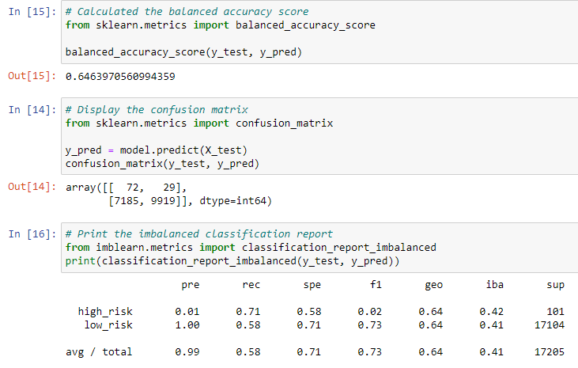
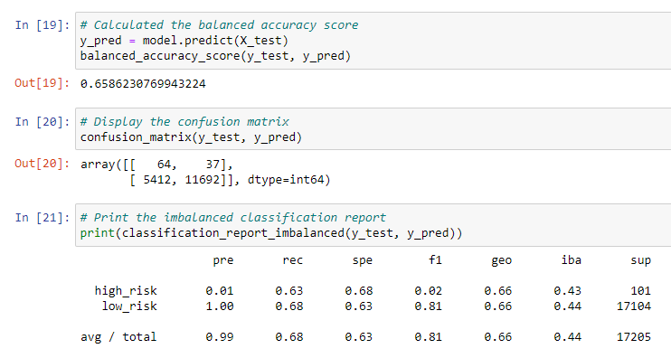
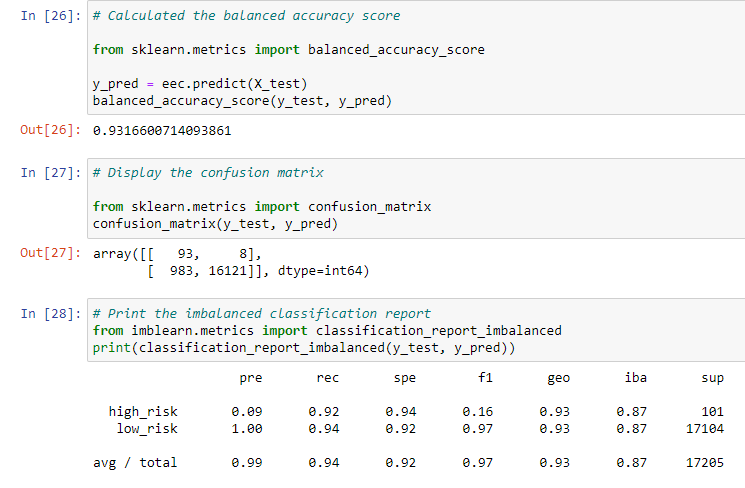

# Credit Risk Analysis

## Overview of the Analysis

We were tasked with using our skills in data preparation, statistical reasoning, and machine learning to assess credit risk. Since it is unbalanced, we had to train and evaluate models using different techniques.

At the end, I will suggest which is the best technique for assessing credit risk.  

## Results

* This is the Oversampling Method.

* This is using SMOTE Oversampling. 

* This is the Cluster Centroids Undersampling.

* This is using SMOTEEN. 

* This is the output using Balanced Random Forest. 

* This is output from Easy Ensemble. 	

## Summary

Based on the various types of techniques we used to assess credit risk, the Easy Ensemble with AdaBoost seems to be the most accurate with the highest precision. Precision sits at .99 like many of the other models, but we were able to boost the accuracy score to .94 using this technique. 

Some of the other techniques have high precision but lack the accuracy. 

